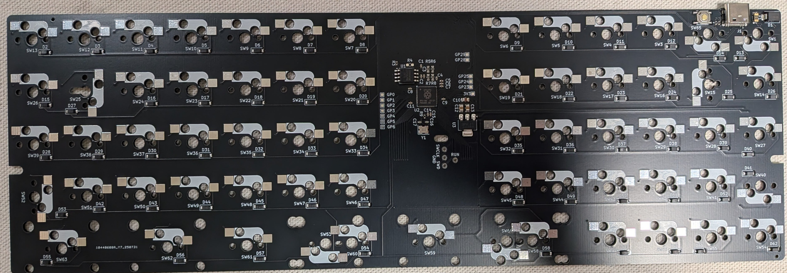
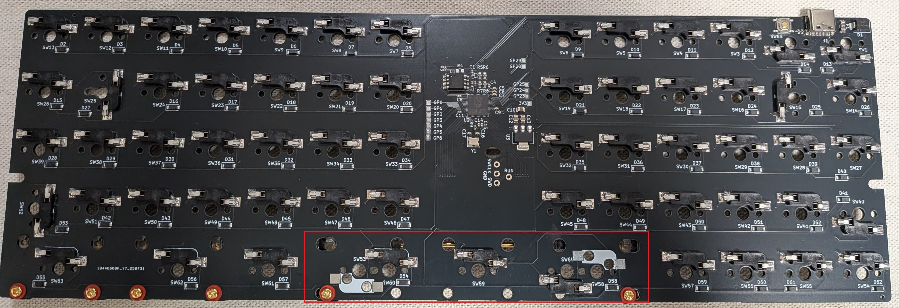
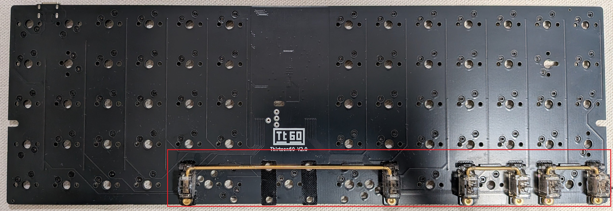
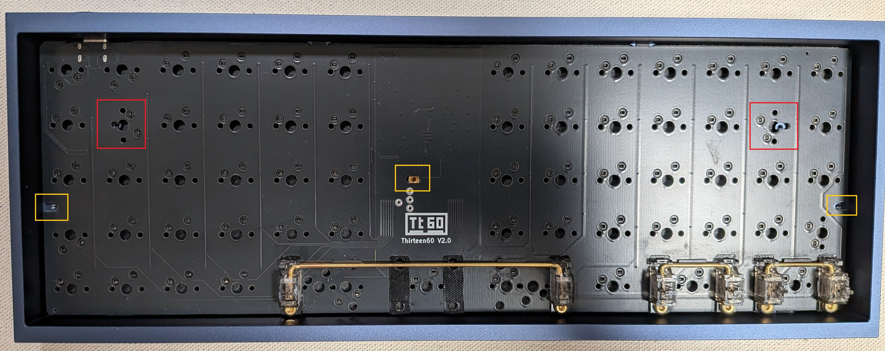
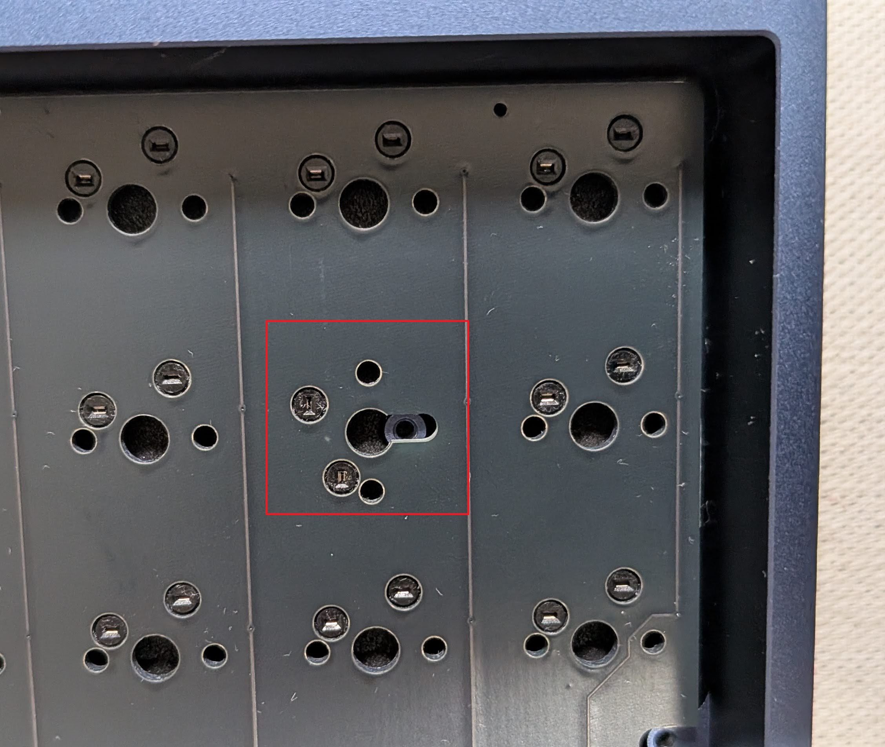
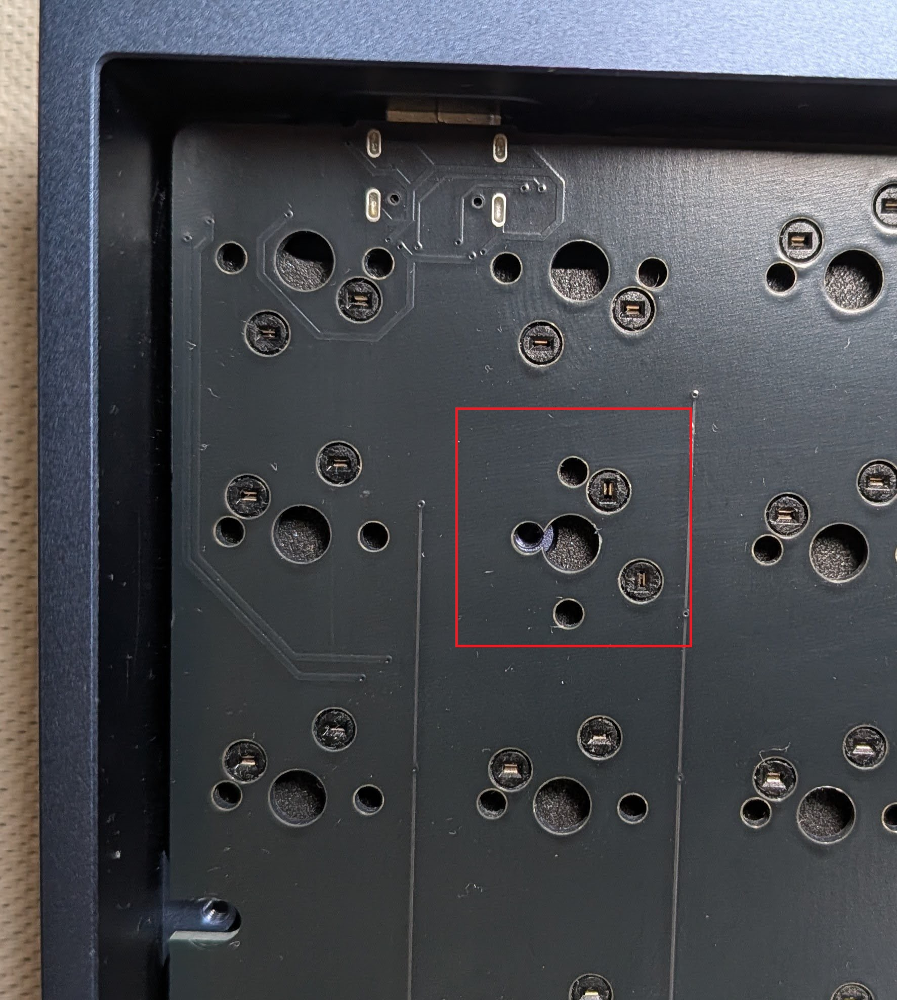
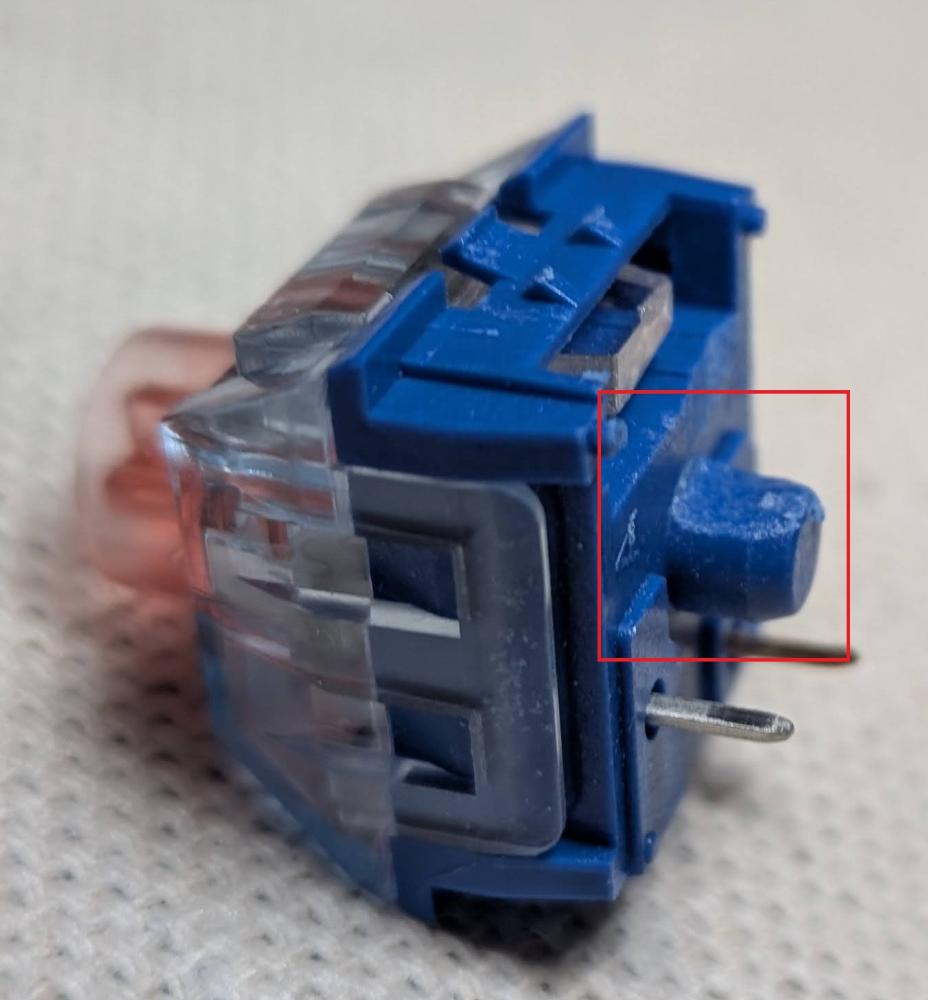
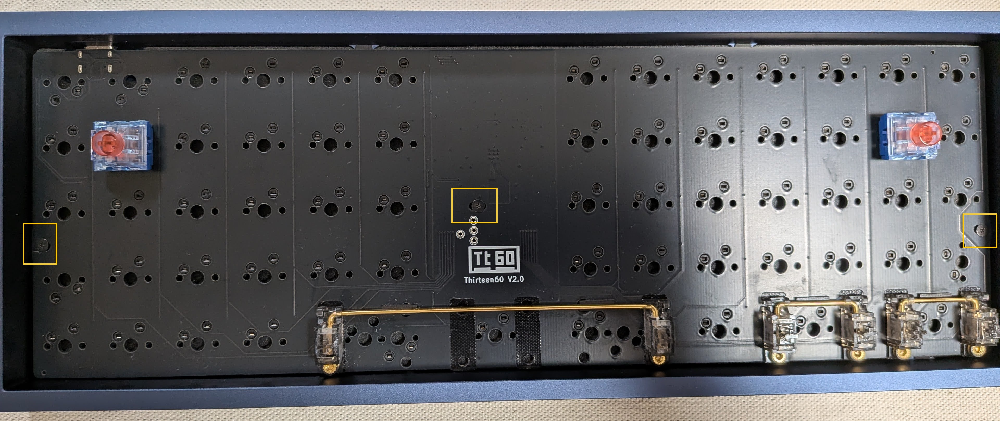
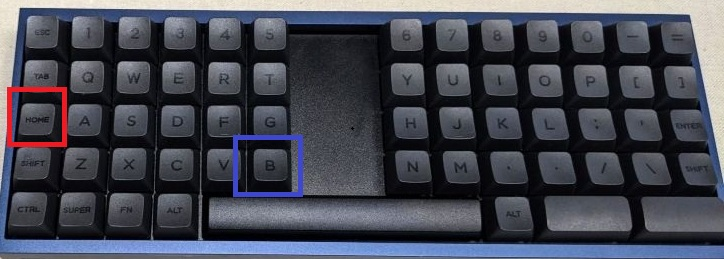
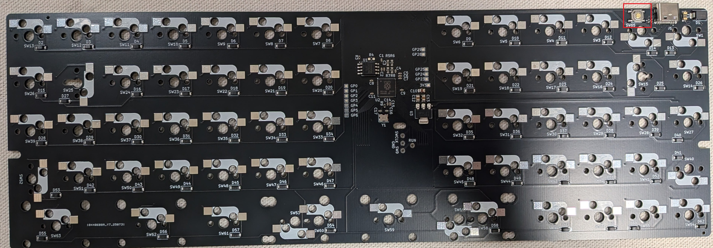

# Thirteen60 ビルドガイド (キーケット2026年版)

このビルドガイドは、キーケット2026年で頒布されたThirteen60キットのビルド手順を説明しています。

※注意 このキットではケースまたはキースイッチに不可逆な加工が必要なため、ビルド前に内容をよく確認してから作業を行ってください。

## 部品リスト

## キットに含まれる部品

- PCB (1個)

## キットに含まれない部品

- Poker/GH60/Tohu60 互換ケース
- MX用 Kailh Switch Socket（60～61個）
- Cherry MX互換 キースイッチ（60～61個）
- キーキャップ（60～61個）
- スタビライザー（必要に応じて）

## オプション

- トッププレート (このディレクトリ内の`thirteen60_plate-Edge_Cuts.dxf`を ***参考*** にして発注してください。)

## ビルド手順

### 1. スイッチソケットの取り付け

スイッチソケットをはんだ付けします。

画像下部の赤枠の箇所は、最終的なスイッチの配置に合わせて、必要な箇所にのみはんだ付けしてください。キーボード最下行の想定しているレイアウトのバリエーションは以下のとおりです。

- 1u 1u 1u 1u 2u 2u 1u 2u 2u
- 1u 1u 1u 1u 3u 3u 1u 2u 2u
- 1u 1u 1u 1u 6u 1u 2u 2u

SW58、SW59、SW64は並列接続されているので、別々のスイッチとして使用することはできません。SW53、SW60も同様です。

調べた限り、6uのスペースバーのキャップの流通は非常に限定的なので、そのレイアウトを使用する場合はご注意ください。

### 2. スタビライザーの取り付け

採用したレイアウトに合わせてスタビライザーを取り付けます。

### 3. ケースまたはスイッチの加工

ケースに基板を配置して、スイッチを取り付けると、上記画像の赤枠の部分が干渉してしまいます。

よって、ケースの加工またはスイッチの加工のいずれかを行う必要があります。

#### 3.1. ケースの加工をする場合

ケースの加工をする場合は、ケース側のネジを止める土台をニッパーなどで切って除去してください。

画像内の赤枠内の基板の下にある部分がそうです。

#### 3.2. スイッチの加工をする場合

スイッチの加工をする場合は、スイッチが装着可能になるまで、中央部分(下記画像赤枠部分)を削ってください。

## 4. ケースへの取り付け

ケースまたはスイッチの加工が完了したら、ケースに基板を取り付けます。

まず、画像内の箇所のスイッチを取り付けてみてください。取り付けができない場合は手順3のどちらかの加工が不十分な可能性が高いので、再度確認してください。

その後、画像黄枠の箇所をネジで止めて固定してください。

## 5. スイッチとキーキャップの取り付け

スイッチとキーキャップを取り付けます。

## 6. ファームウェアの書き込み

キーケット2026で販売している基板には、`firmware/prebuilt/karugaru_thirteen60_v2_default.uf2`にあるファームウェアが書き込まれています。

ファームウェアを書き換えるには、キーボードをブートローダーモードにする必要があります。ブートローダーモードにすると、キーボードがUSBストレージデバイスとして認識されるようになるので、ファームウェアを書き込むことができます。

### 6.1 書き込み方法

販売時の書き込み済みファームウェアでは、上記画像の赤枠のキーを押下しながら青枠のキーを押下することで、キーボードをブートローダーモードにすることができます。

### 6.2 ブートローダーモードにするキー設定を削除してしまった場合

誤ってブートローダーモードにするキー設定を削除してしまった場合は、上記画像の赤枠のスイッチを押下しながらUSBケーブルを接続することで、キーボードをブートローダーモードにすることができます。

### 6.3 注意

ファームウェアは[QMK Firmware](https://github.com/qmk/qmk_firmware)を使用しています。

ボード固有の設定などのソースコードは`firmware/karugaru`ディレクトリに配置しています。
ビルド済みのファームウェアは`firmware/prebuilt`ディレクトリに配置しています。

本来はqmk_firmwareにプルリクエストをする予定でしたが、マージの手間などを考慮して独立したリポジトリとして管理しています。
利用する場合はご自身でQMK Firmwareをクローン/フォークした後に、`qmk_firmware/keyboards`に`firmware/karugaru`をコピーして使用してください。

ビルドの手順などについては、QMK Firmwareのドキュメントを参照してください。
